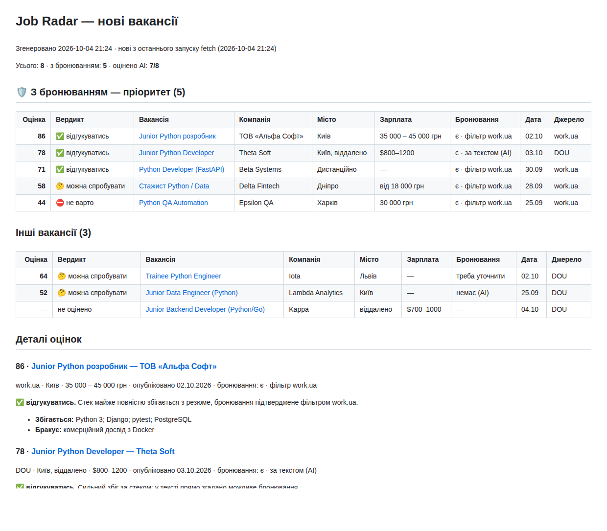

# job-radar

CLI на Python, который собирает вакансии с украинских джоб-бордов, складывает их в SQLite,
показывает только то, что появилось с прошлого запуска, и (по желанию) оценивает каждую
вакансию под ваше резюме через Claude.

```
fetch  →  rank (опционально, нужен ключ)  →  report
```



<sub>Скриншот отчёта на демо-данных: компании и вакансии вымышлены. Тот же отчёт в markdown — [docs/sample-report.md](docs/sample-report.md).</sub>

## Что умеет

- **Сбор** с work.ua и jobs.dou.ua. На work.ua параметр `?deferment=1` оставляет только
  вакансии с бронированием от мобилизации — такие вакансии помечаются как приоритетные.
- **Только новое.** Дедупликация по ссылке: при повторном запуске уже известные вакансии
  не считаются новыми и их страницы повторно не открываются.
- **AI-оценка (опционально).** Claude получает текст вакансии и ваше резюме и возвращает
  строго структурированный ответ: оценку 0–100, вердикт, что совпадает, чего не хватает,
  есть ли бронирование, и короткий вывод. Без ключа всё остальное работает как обычно.
- **Отчёт** в markdown или CSV: сначала вакансии с бронированием, внутри — по оценке.

### Статус источников

| Источник | Статус | Что собирается |
|---|---|---|
| work.ua | ✅ реализован | список (до `max_pages` страниц) + страница вакансии: зарплата, компания, город, условия, полный текст. Бронирование — из фильтра `?deferment=1` |
| jobs.dou.ua | ✅ реализован | первая страница списка + подгрузка «Більше вакансій» (XHR), страница вакансии с полным текстом. Бронирование — по упоминанию в тексте |
| robota.ua | ⛔ заглушка | не реализован, см. ниже |

> **Важно: парсеры не проверены на живых сайтах.** Код писался в облачной песочнице, сетевая
> политика которой блокировала `www.work.ua`, `jobs.dou.ua` и `robota.ua`. Поэтому разметка
> страниц воспроизведена по известной вёрстке этих сайтов, а тесты гоняются на
> реконструированных фикстурах (`tests/fixtures/`), а не на сохранённых страницах.
> Первый реальный запуск стоит сделать с `--save-html` — см. [«Если парсер сломался»](#если-парсер-сломался).
> Для work.ua есть запасные селекторы под старую вёрстку, а при пустой первой странице любой
> парсер пишет предупреждение.

**robota.ua** оставлен заглушкой с TODO (`jobradar/sources/robotaua.py`): сайт был недоступен,
а это одностраничное приложение, где вакансии, судя по всему, подгружаются скриптом из их API —
писать такой парсер вслепую, без возможности проверить запросы и фильтр «Бронювання
співробітників», не стали. В `config.yaml` источник выключен; если включить, `fetch` напишет
предупреждение и пропустит его.

## Установка

Нужен Python 3.11+.

```bash
git clone <repo> job-radar && cd job-radar
python -m venv .venv
source .venv/bin/activate          # Windows: .venv\Scripts\activate
pip install -r requirements.txt
```

Зависимости: `httpx`, `selectolax`, `pydantic`, `anthropic`, `pyyaml` (+ `pytest` для тестов).

## Настройка

1. **Запросы и ключевые слова** — в [`config.yaml`](config.yaml). Каждый запрос — это обычная
   ссылка на поиск, скопированная из браузера:

   ```yaml
   sources:
     workua:
       enabled: true
       queries:
         - name: python-бронь
           url: https://www.work.ua/jobs-python/?deferment=1
         - name: it-бронь
           url: https://www.work.ua/jobs-it/?deferment=1
           include: [python, django, backend, junior]   # фильтр только для этого запроса
     dou:
       enabled: true
       queries:
         - url: https://jobs.dou.ua/vacancies/?category=Python&exp=0-1

   keywords:
     include: []                         # пусто — брать всё
     exclude: [senior, lead, architect]  # выбросить по заголовку
   ```

   Слова сравниваются по началу слова без учёта регистра: `стажист` найдёт и «стажиста».
   Признак бронирования для work.ua определяется по `deferment=1` в ссылке; для любого запроса
   его можно задать явно через `deferment: true`.

   Вежливость к сайтам (секция `http`): браузерный User-Agent, пауза `delay_seconds` (+ случайные
   0–50%) между запросами, не больше `max_pages` страниц списка на запрос и
   `max_details_per_run` страниц вакансий на источник за запуск (остальные новые обработаются
   в следующий раз). При ошибке запрос повторяется один раз, дальше — запись в лог и следующий
   источник.

2. **Резюме** (нужно только для AI-оценки):

   ```bash
   cp profile.example.md profile.md   # и впишите своё резюме
   ```

   `profile.md` в `.gitignore` — в репозиторий не попадёт.

3. **Ключ Anthropic** (только для AI-оценки) — берётся исключительно из переменной окружения
   `ANTHROPIC_API_KEY`:

   ```bash
   cp .env.example .env               # и вставьте ключ
   # или: export ANTHROPIC_API_KEY=sk-ant-...
   ```

   Если рядом с `config.yaml` или в текущей папке лежит `.env`, переменные из него
   подхватываются автоматически (уже заданные в окружении имеют приоритет).

## Команды

```bash
python -m jobradar fetch                # собрать новое
python -m jobradar rank                 # оценить новое через Claude
python -m jobradar report               # отчёт в markdown → reports/report-YYYY-MM-DD_HHMM.md
python -m jobradar report --csv         # то же в CSV (с BOM, открывается в Excel)
```

Полезные опции:

```bash
python -m jobradar fetch --rank                 # собрать и сразу оценить (если ключ задан)
python -m jobradar fetch --source workua        # только один источник
python -m jobradar fetch --save-html debug-html # сохранить ответы сайтов для отладки
python -m jobradar rank --limit 20              # не больше 20 оценок за раз
python -m jobradar rank --batch-api             # через Message Batches API — в 2 раза дешевле
python -m jobradar report -o -                  # отчёт в консоль
python -m jobradar report --days 7              # всё, что нашлось за неделю
python -m jobradar report --all --min-score 60  # вся база, только оценка ≥ 60
python -m jobradar -c other.yaml -v fetch       # другой конфиг, подробные логи
```

Типичный цикл раз в два дня:

```bash
python -m jobradar fetch --rank && python -m jobradar report
```

Так выглядит вывод `fetch` (числа условные):

```
21:05:12 INFO    work.ua [python-бронь] стр. 1: 14 вакансий
21:05:15 INFO    work.ua [python-бронь] стр. 2: 9 вакансий
21:05:41 INFO    work.ua: найдено 21 (отфильтровано 2), новых 6, ошибок 0
21:05:44 INFO    DOU [python-0-1] стр. 1: 20 вакансий
21:05:47 WARNING DOU [python-0-1]: ошибка запроса, иду дальше: …/xhr-load/…: HTTP 403
21:06:02 INFO    DOU: найдено 18 (отфильтровано 2), новых 3, ошибок 1
21:06:02 INFO    Итого: найдено 39, новых 9, ошибок 1, запросов к сайтам 16
```

### Что считается «новым»

`fetch` записывает каждый запуск. `report` по умолчанию показывает вакансии, впервые найденные
**последним** запуском `fetch` — то есть ровно то, что появилось с прошлого раза. Если
последний `fetch` ничего не нашёл, отчёт так и скажет; старое можно посмотреть через
`--days N` или `--all`. `report` ничего не меняет в базе, его можно запускать сколько угодно раз.

## AI-оценка

- Модель задаётся в `config.yaml` → `ai.model`, по умолчанию `claude-haiku-4-5`.
- Используется официальный SDK `anthropic` и structured outputs (`messages.parse` с
  pydantic-моделью): ответ гарантированно соответствует схеме и дополнительно валидируется
  pydantic.

  ```json
  {
    "score": 82,
    "verdict": "відгукуватись",
    "matches": ["Python 3", "Django", "pytest"],
    "gaps": ["комерційний досвід з Docker"],
    "deferment": "є",
    "note": "Стек майже повністю збігається з резюме, бронювання прямо вказане."
  }
  ```

- **Пакетами и с ретраями.** Вакансии обрабатываются пакетами по `ai.batch_size`
  (внутри — `ai.concurrency` параллельных запросов), результаты пишутся в базу после каждого
  пакета. SDK сам повторяет 429/5xx/обрывы связи; сверх этого каждая вакансия получает до
  `ai.max_attempts` попыток с растущей паузой (невалидный или обрезанный JSON — повтор с
  удвоенным `max_tokens`). Ошибки ключа, неверная модель, нехватка баланса останавливают
  оценку сразу — уже сохранённые оценки не теряются. Отказ модели оценивать — пропуск вакансии.
- **Повторно одну и ту же вакансию не оценивает.** Неоценённые из-за ошибок попробуются при
  следующем `rank`. За один запуск — не больше `ai.max_per_run` оценок (защита бюджета).
- `rank --batch-api` отправляет всё одним пакетом в Message Batches API (в 2 раза дешевле,
  обычно готово за минуты, максимум — 24 часа). Команда ждёт до `--wait` минут (по умолчанию 30);
  если пакет не готов — просто запустите `rank --batch-api` позже, результаты подтянутся.
- Резюме уходит в system prompt с пометкой для кэширования промпта. Кэш срабатывает, только если
  инструкция + резюме длиннее минимального размера кэша модели — с коротким резюме это просто
  обычный запрос.
- Если поменяете модель на более крупную, увеличьте `ai.max_tokens` (например, до 4000) и при
  необходимости задайте `ai.effort: low` — у Haiku 4.5 параметра effort нет.

## Хранилище

SQLite-файл `jobradar.db` (путь — `database` в конфиге):

- `vacancies` — id, источник, ссылка (уникальна), заголовок, компания, город, зарплата, дата
  публикации, признак бронирования (`yes` — фильтр сайта, `mentioned` — упоминание в тексте),
  полный текст, краткое описание, когда впервые/последний раз видели, в каком запуске нашли;
- `scores` — оценки Claude (одна на вакансию);
- `runs` — запуски `fetch`; `ai_batches` — пакеты Batches API.

## Если парсер сломался

Сайты меняют вёрстку. Признаки: предупреждение «на первой странице 0 вакансий», пустые
компании/зарплаты или «не нашёл текст вакансии». Что делать:

```bash
python -m jobradar fetch --source workua --save-html debug-html -v
```

В `debug-html/` окажутся все ответы сайта. Скопируйте нужные страницы в `tests/fixtures/`
(имена — в [tests/fixtures/README.md](tests/fixtures/README.md)), поправьте селекторы в
`jobradar/sources/<источник>.py` и ожидания в `tests/test_sources.py`, прогоните `pytest`.

## Как добавить источник

1. Создайте `jobradar/sources/<имя>.py` с классом-наследником `Source`, помеченным `@register`:
   `name` — ключ в `config.yaml`, методы `parse_list(html, page_url)`, `parse_detail(html, vacancy)`
   и при необходимости `next_page_url(...)` или собственный `iter_list_pages(...)`
   (как в `dou.py`, где следующие страницы грузятся POST-запросом).
2. Импортируйте модуль в `jobradar/sources/__init__.py`.
3. Добавьте секцию в `config.yaml`, фикстуры и тесты.

Остальной код (сбор, фильтры, база, оценка, отчёт) трогать не нужно.

## Тесты

```bash
pip install -r requirements.txt
pytest
```

Тесты не ходят в сеть (сокеты в них запрещены): парсеры проверяются на HTML-фикстурах,
конвейер `fetch` — через `httpx.MockTransport`, AI-слой — через подставной клиент и через
настоящий SDK с подменённым HTTP-транспортом.

## Структура

```
jobradar/
  cli.py          команды fetch / rank / report
  config.py       config.yaml → pydantic-модели, загрузка .env
  http.py         вежливый HTTP-клиент (UA, паузы, повтор, --save-html)
  fetcher.py      обход источников, фильтры, дедупликация, лимиты
  db.py           SQLite
  ranking.py      оценка через Claude (structured outputs, пакеты, ретраи, Batches API)
  report.py       markdown и CSV
  sources/        base.py (интерфейс), workua.py, dou.py, robotaua.py (заглушка)
tests/            pytest + fixtures/
```
